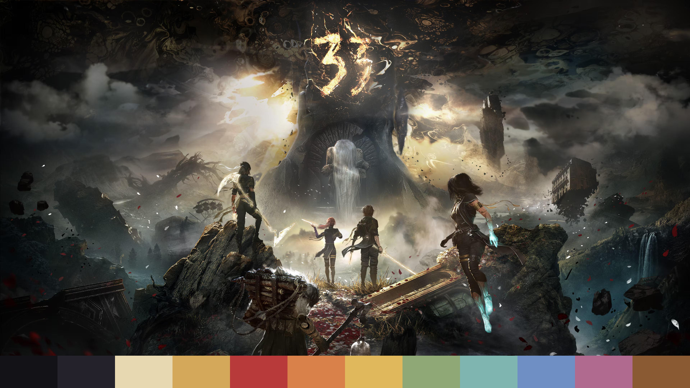
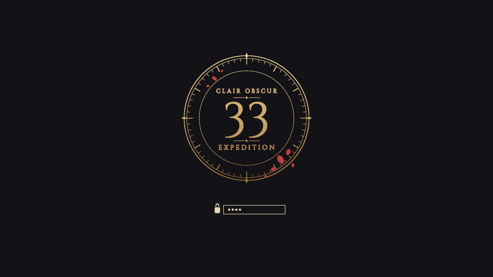

# Omarchy Clair Obscur Theme

An [Omarchy](https://omarchy.org) theme inspired by **Clair Obscur: Expedition 33**: gilded Belle Époque gold on Paintress-night ink, Lumière crimson, aurora teal, and the cream of an expedition journal. Window borders glow in a gold-to-crimson gradient.

## Preview



### Boot / unlock screen

A gilded "33" emblem set in a countdown-clock ring with drifting crimson petals, shown on the Plymouth disk-unlock screen.



To use it as your boot screen:

```bash
omarchy plymouth set by theme clair-obscur
```

## Install

```bash
omarchy theme install https://github.com/lookiyam-94/omarchy-clair-obscur-theme
```

## Palette

| Role | Color |
|------|-------|
| Background | `#131217` |
| Foreground | `#e7d8b1` |
| Accent (gold) | `#d4a85a` |
| Red (crimson) | `#b83a3a` |
| Orange | `#d9814a` |
| Yellow | `#e0b85c` |
| Green | `#8fa876` |
| Cyan | `#7fb5b0` |
| Blue | `#6f8fc4` |
| Magenta | `#b06a8f` |
| Brown | `#8a5a33` |

Everything is driven by `colors.toml`; Omarchy generates the terminal, editor, shell, btop and other app themes from it.

## Wallpapers

Ten wallpapers in `backgrounds/`. Cycle through them with `omarchy theme bg next`.

## Credits

Clair Obscur: Expedition 33 and its artwork are © Sandfall Interactive / Kepler Interactive. Wallpapers are fan-collected from [wallhaven.cc](https://wallhaven.cc) and are included for personal use only; they are not covered by this repository's license. The unlock emblem is original artwork for this theme, set in [Cinzel](https://fonts.google.com/specimen/Cinzel) (SIL OFL). This is an unofficial fan theme.
